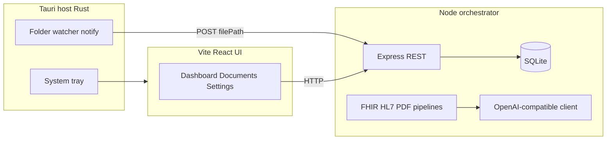

# Architecture

Sift is a **local-only** desktop application composed of three main parts: a **native host**, a **Node orchestrator**, and a **web UI**.

## High-level diagram

## Components

### Tauri host (`src-tauri/`)

- **Window + WebView:** loads the built or dev UI (`tauri.conf.json` → `devUrl` / `frontendDist`).
- **System tray:** Show / Quit; uses the bundled window icon.
- **Folder watch:** Uses `notify` with recursive watching on the user-selected path. On create/modify events for files, the host issues an HTTP **POST** to `http://127.0.0.1:4000/api/ingest` with `{ "filePath": "..." }`.
- **Command:** `set_watch_folder` — starts or replaces the watcher (previous watch is cancelled).

### Node orchestrator (`backend/`)

- **Express** on `127.0.0.1` — health, settings, document listing, single-document fetch, ingest.
- **SQLite** (`better-sqlite3`) — settings, document rows, summaries, confidence, error messages.
- **Ingest pipeline:**
  - Detects **FHIR JSON**, **HL7-like text**, or **PDF** (by extension and content hints).
  - Extracts a text preview / structured highlights.
  - Calls the **LLM** for a clinical-style narrative; on failure, stores a **heuristic** summary.

### Frontend (`frontend/`)

- **React + Tailwind** — dashboard status, document list and detail, printable report view, settings (folder dialog via `@tauri-apps/plugin-dialog`, LLM fields via API).
- **Tauri invoke** — `set_watch_folder` when a watch path is chosen or restored from settings (guarded so plain browser dev does not crash).

## Data flow: zero-click ingest

1. User selects a **watch folder** in Settings (stored in SQLite).
2. Tauri starts **notify** on that path.
3. New file → host POSTs path to **`/api/ingest`**.
4. Backend reads file, classifies pipeline, persists a **document** row with **summary** and **confidence**.

## Security boundary

All network I/O for the product is **loopback** to the local orchestrator and (optionally) the local LLM HTTP server. No cloud service is required for core operation. See [Security and compliance](SECURITY-AND-COMPLIANCE.md).

## Related docs

- [Transform summary](Transform-Summary.md) — product strategy
- [Configuration](CONFIGURATION.md)
